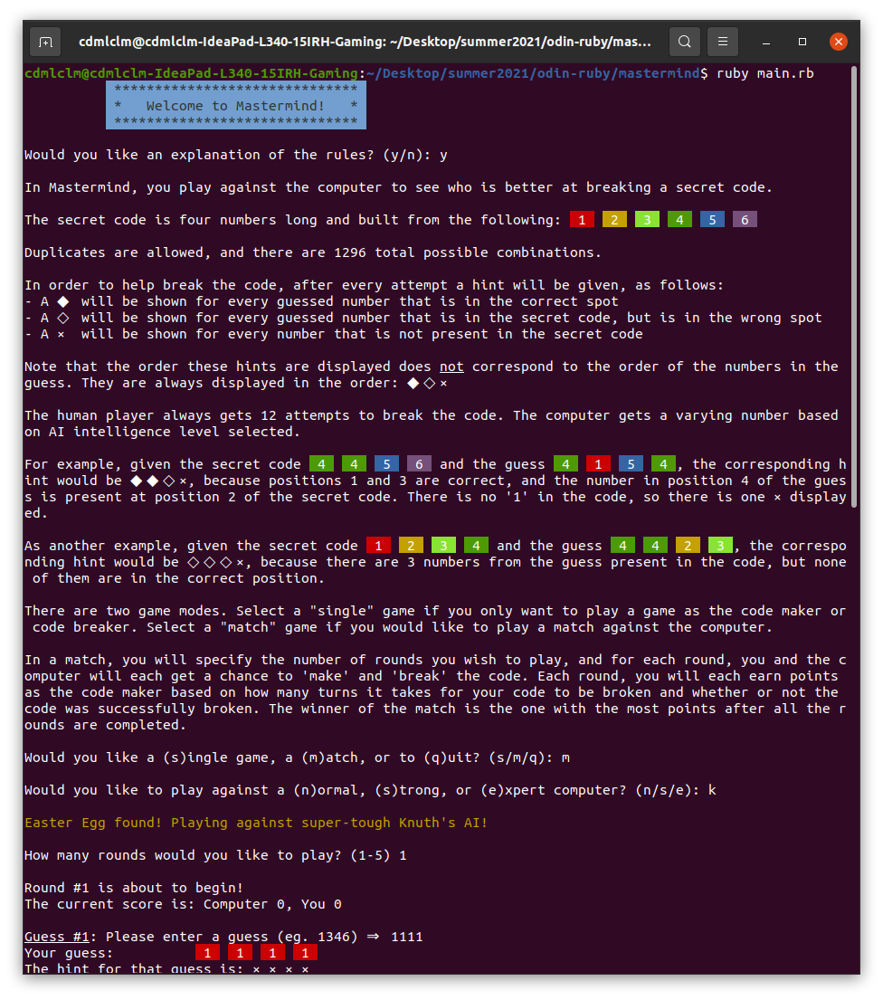
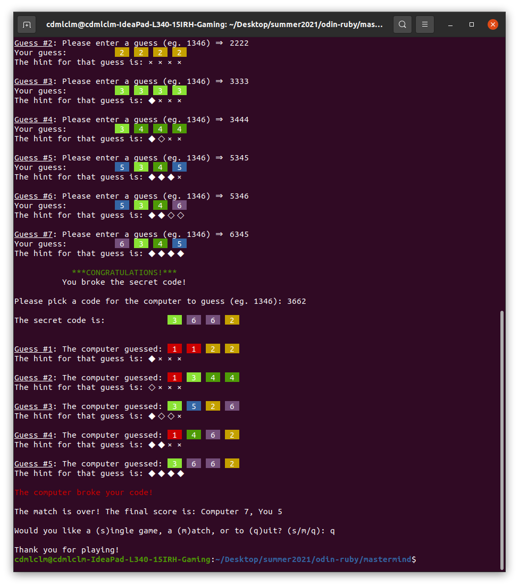

# Ruby Mastermind

## Objective

As part of [The Odin Project](https://www.theodinproject.com/paths/full-stack-ruby-on-rails/courses/ruby-programming/lessons/mastermind)'s
curriculum, build a command-line Mastermind application while focusing on Object-Oriented principles.

## Requirements

1. Game should make use of OOP principles
2. Human player should have the option to break the code or set the code

## Runtime Example

## Author's Notes

### Preliminary Thoughts

My first foray into Ruby programming ended here...not particularly because of the project, but because at the time
this was "only" a hobby and competing interests took precedence. Still, it's a little bit personal. Definitely not
going to leave anything on the table with this one.

### Final Thoughts

Definitely feeling vindicated after completing this project. I'm very satisfied with the overall architecture of the
application, and with the extent of "above-and-beyond" extras implemented, such as various AI strengths and the
ability to play matches (per Mastermind rules). I'm starting to feel comfortable with Ruby again, but this time my
grasp of OOP is vastly stronger than what it was when I was at this part of TOP curriculum last time. When testing the
performance of Knuth's AI on repl.it, I noticed some subtle differences in how the applications displays there
compared with my local terminal. As a result, there will be a 'master' branch in this repo optimized for the Linux
terminal, and a 'replit' branch optimized for display on replit.

Speaking of the performance of Knuth's AI, the minimax portion of the algorithm is computationally expensive, and
takes about 15 seconds to run the first guess calculation on replit. As a result, Knuth's AI is an 'Easter egg' -
simply select `k` instead of the provided options `n`, `s`, and `e` when it is time to select an opponent.

It was surprisingly difficult to come up with _coherent_ AIs that are meaningfully weaker than the 'expert' AI. It
turns out that if you maintain a list of all possible secret codes, pruning it after each guess, then you'll get the
secret code within 6 guesses pretty much guaranteed just guessing randomly. This is even fairly easy to do without
computer assistance if you slightly modify it to the following strategy:

Start with `1111`, then for subsequent guesses, pick the lowest possible number that is congruent with all previous
hints. I solved quite a number of codes during development and testing, and this generally gives an answer in 5 or 6
guesses.

Overall this was a very fun little project and despite getting sidetracked by a very busy weekend when it was about
70% done, it wasn't hard to implement the final features (mainly the match functionality) when I had time to get back
to it.

## Live Demo

The application is available for you to try out on [repl.it](https://replit.com/@CodyMalcolm/odin-mastermind).
